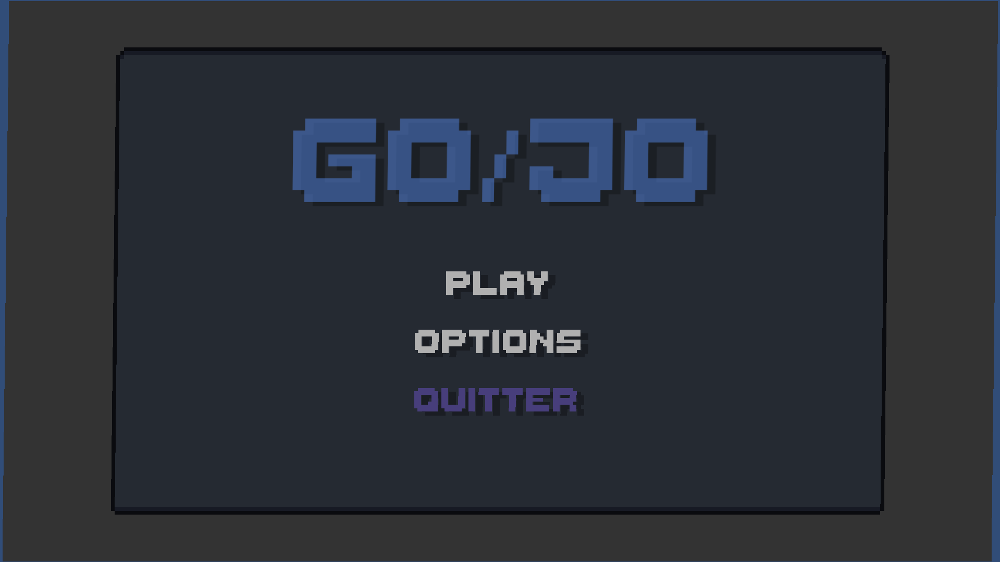
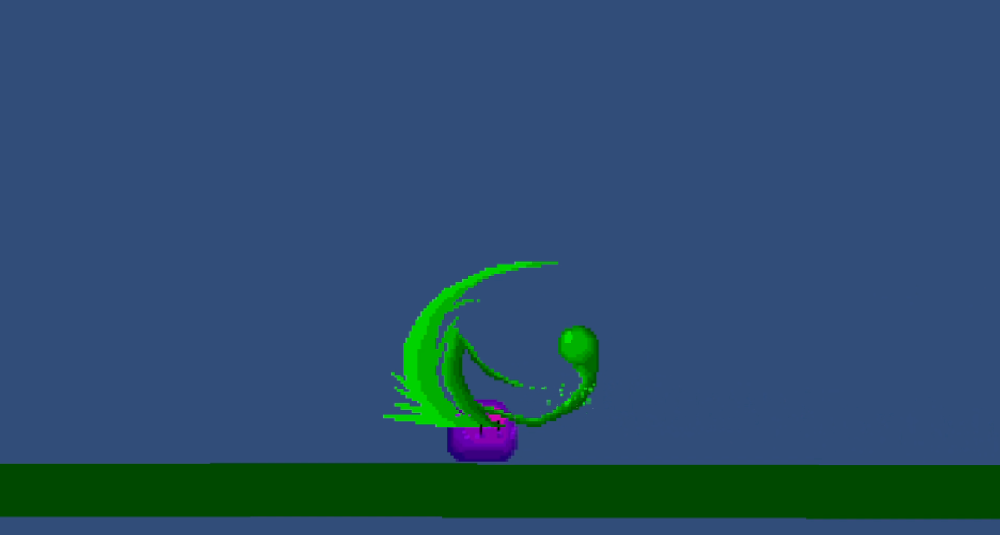
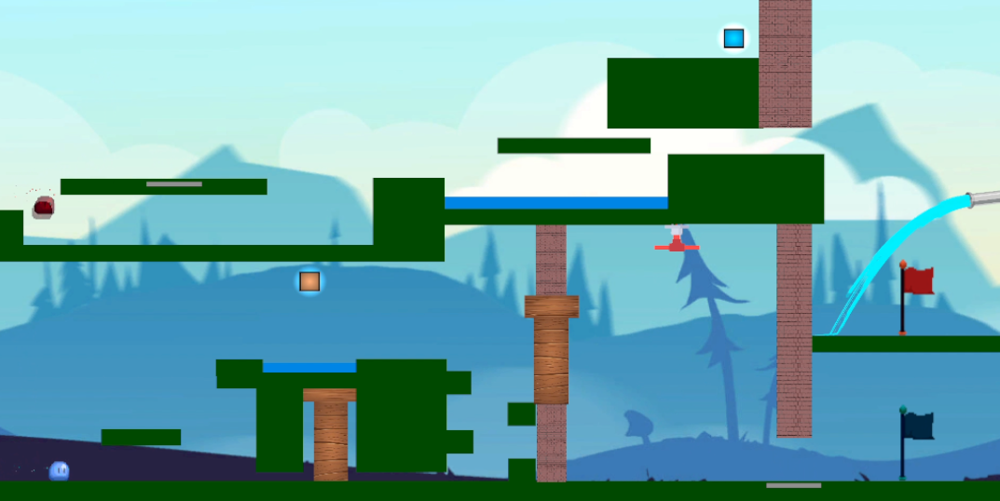
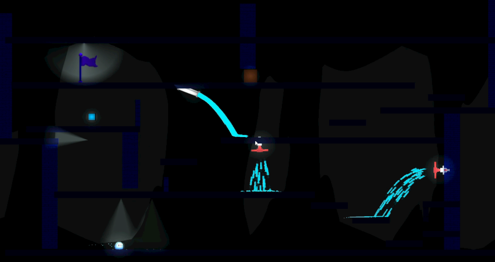
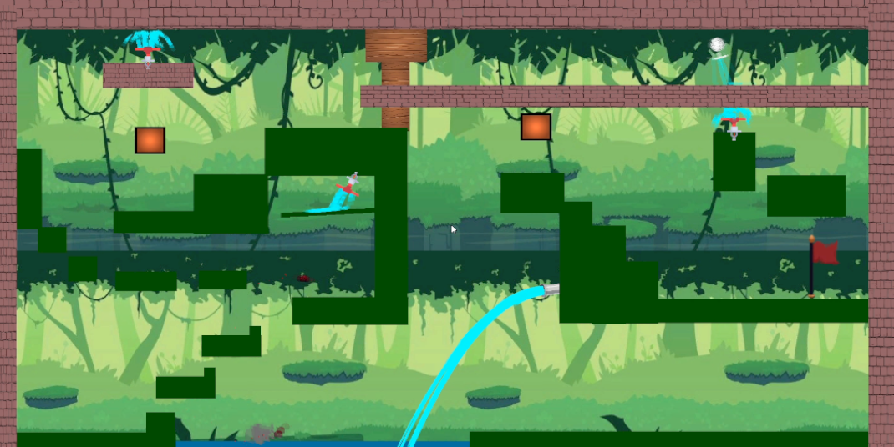

# GO-JO

Développement d'un jeu 2D sur Unity pour découvrir le moteur.  
Réalisation en équipe de 3 avec 2 semaines de travail.

## Description

GO-JO est un jeu en 2D où vous jouez 2 slimes souhaitant retrouver leur puissance perdu.
Vous pouvez vous diviser, vous réunir mais faîtes attention à l'eau qui n'est pas votre allié.

## Technologies utilisées

- Unity
- C#
- Git

## Captures d’écran

## Contrôles

- QD    : déplacements
- SPACE : saut
- E     : division de slime

## Auteurs

Benjamin Benon  
[LinkedIn](https://www.linkedin.com/in/benjamin-benon-78b495194/)
Gianni Charles-Nicolaï
Grégoire Portevin
